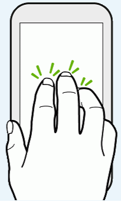

## Lesson 1. Build a photo album

### Step 1. Add a navbar

Kendo UI Mobile apps are made up of views, and a basic one view has already been created for you (`<div data-role="view">`). To liven up this view, you'll start by adding a Kendo UI NavBar widget to display the view's title.

<hr data-action="start" />

#### Action

* **a**. Add markup to the view so that it looks this:
```
<div data-role="view">
    <div data-role="navbar">
        <span data-role="view-title"></span>
    </div>
</div>
```

> Tip: Keyboard shortcut `Ctrl` + `Alt` + `F` cleans up indentation and formatting for you. Try using it after you paste in code throughout these lessons.

* **b**. Add a `data-title` attribute to the view, e.g. `<div data-role="view" data-title="Photos">`.
* **c**. Save the index.html file.

<hr data-action="end" />

Kendo UI Mobile automatically styles the navbar to look great on each platform. To see what this looks like, let’s try this app out in the AppBuilder simulators.

<hr data-action="start" />

#### Action

* **d**. Open the iPhone 5 simulator by selecting **Run** --> **iPhone 5**.
* **e**. With the simulator open, change the title of the view by updating its `data-title` attribute—for instance `<div data-role="view" data-title="My Cool Photos">`.
* **f**. Save your index.html file and note how the simulator updates automatically.

<hr data-action="end" />

The simulators automatically update with every change you make. Take a minute to experiment with the various controls the simulator offers. You can simulate multiple devices, rotate devices to test portrait & landscape modes, and a lot more.

### Step 2. Show data in a listview

Your next step is to show some photos in your album, and you'll use the Kendo UI ListView widget to do that. The ListView widget automatically handles complex use cases such as endless scrolling and pull-to-refresh, but for now you'll start by displaying a static list of images.

<hr data-action="start" />

#### Action

* **a**. Add a `<ul>` element underneath the navbar with an `id` of `"images"` (`<ul id="images"></ul>`). The view should look like this:
```
<div data-role="view" data-title="Photos">
    <div data-role="navbar">
        <span data-role="view-title"></span>
    </div>
    <ul id="images"></ul>
</div>
```
* **b**. Save the index.html file.
* **c**. Open the project's app.js file, located in the scripts folder.
* **d**. In your app.js, use the code below to select the `<ul>` with jQuery and convert it into a ListView widget. Place this code directly after the `kendo.mobile.Application()` call, as the Kendo UI Mobile app needs to exist before you initialize widgets.
```
$("#images").kendoMobileListView({
    dataSource: ["images/01.jpg", "images/02.jpg", "images/03.jpg", "images/04.jpg", "images/05.jpg", "images/06.jpg", "images/07.jpg"],
    template: ""
});
```
* **e**. Run this in the simulator to see how the photos display.

<hr data-action="end" />

### Step 3. Deploy your app using the companion app

The AppBuilder companion app makes it easy to test your app on real devices, without the need to manage SDKs or deal with complex provisioning options.

<hr data-action="start" />

#### Action

* **a.** Get out your iOS, Android, or Windows Phone device.
* **b**. Download and install the AppBuilder companion app from your device's app store—i.e. the App Store for iOS users, Google Play for Android users, or the Windows Store for Windows Phone users (search for **AppBuilder**).

[](https://itunes.apple.com/us/app/telerik-appbuilder/id527547398?mt=8)
[](https://play.google.com/store/apps/details?id=com.telerik.AppBuilder&hl=en)
[](http://www.windowsphone.com/en-us/store/app/appbuilder/0171d46b-b5f2-43d9-a36b-0a78c9692aab?signin=true)

* **c**. In the browser, select **Run** --> **Build**, select your device's platform (iOS/Android/Windows Phone), choose "AppBuilder companion app", and click Next.
* **d**. Scan the resulting QR code on your device.

<hr data-action="end" />

When scanned, the QR code launches the AppBuilder companion app on your device, and shows the image gallery app you just built. Now that you have the app on your device, let's make some changes.

<hr data-action="start" />

#### Action

* **e**. Change the `data-title` attribute of the app's view (for instance `<div data-role="view" data-title="My Awesome Photos">`).
* **f.** Save your index.html file.
* **g**. On your device, within the companion app, tap with three fingers and hold until a popup appears.


<hr data-action="end" />

This process is known as *LiveSync*, and it makes updating your apps as easy as a quick tap. Now that you have a functioning app, and can test it on your device, let's see how to use the device's camera.
