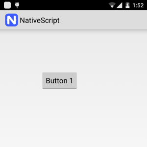
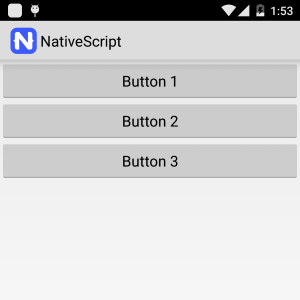
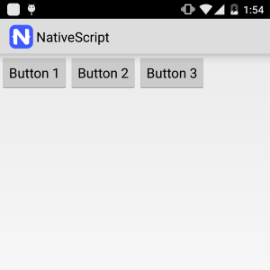
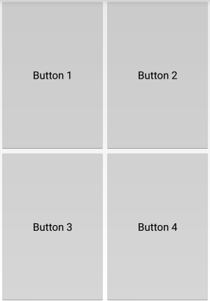
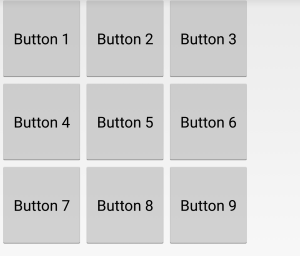
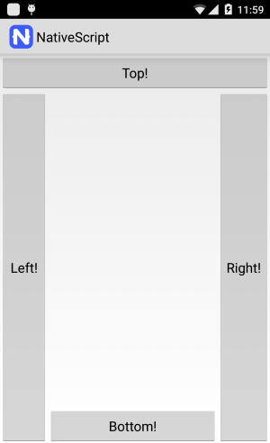
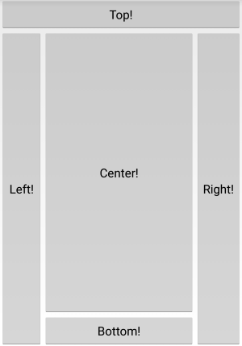
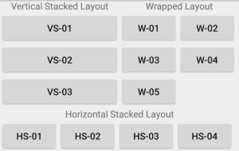

## Lesson 1. Working with app layouts

### Step 1. Common app layout

NativeScript provides a flexible layout system that enables you to specify how controls are positioned and shown on the screen. This tutorial goes through the various layout options and demonstrates how to design a user interface that automatically sizes to various screen resolutions.

The NativeScript layout system supports both absolute and dynamic layouts.

**Absolute Layout**

In an absolute layout, controls are positioned using explicit x/y coordinates.

**Dynamic Layout**

In dynamic layout, the user interface automatically sizes to match the available screen space.

**Layout Panels**

The built-in layouts in NativeScript are **AbsoluteLayout**, **StackLayout**, **GridLayout**, **DockLayout** and **WrapLayout**.

### Step 2. Create absolute layout

The AbsoluteLayout is the most basic layout in NativeScript. It allows you to position child elements by specifying x/y coordinates relative to the AbsoluteLayout. Тhe **left** / **top** properties allow you to set the position of a child element relative to the top-left corner of the AbsoluteLayout container. The AbsoluteLayout is useful for scenarios where the child elements contained within require little to no movement. 

<hr data-action="start" />

#### Action

* **a**. Add the following markup to position a single child inside a AbsoluteLayout using the top and left properties.

> Tip: Keyboard shortcut `Ctrl` + `Alt` + `F` cleans up indentation and formatting for you. Try using it after you paste in code throughout these lessons.

```
<Page>
    <AbsoluteLayout>
        <Button text="Button 1" left="100" top="100" />
    </AbsoluteLayout>
</Page>
```

* **b**. Save the xml file and sync your app.

<hr data-action="end" />



### Step 3. Create stacked layout

The StackLayout arranges its child elements into a single line. It supports both horizontal and vertical orientation. The default value for the orientation property is vertical. StackLayout is typically used in scenarios where you want to arrange a small subsection of the UI on your page.

<hr data-action="start" />

#### Action

* **a**. Add the following markup to create a **vertical** StackLayout.

```
<Page>
  <StackLayout orientation="vertical">
    <Button text="Button 1" />
    <Button text="Button 2" />
    <Button text="Button 3" />
  </StackLayout>
</Page>
```

* **b**. Save the xml file and sync your app.

<hr data-action="end" />



#### Action

* **a**. Add the following markup to create a **horizontal** StackLayout.

```
<Page>
  <StackLayout orientation="horizontal">
    <Button text="Button 1" verticalAlignment="top"/>
    <Button text="Button 2" verticalAlignment="top"/>
    <Button text="Button 3" verticalAlignment="top"/>
  </StackLayout>
</Page>
```

* **b**. Save the xml file and sync your app.

<hr data-action="end" />



### Step 4. Create table layout

To achieve table layout you use use the GridLayout. The GridLayout arranges its children in multi-row and multi-column layouts. You use the **rows** and **columns** attributes to set the number of rows and columns.

**Setting size for rows and columns**

You can set the size of rows and columns by setting a specific size in pixels or by using auto or star sizing. 

**Auto and Star Sizing**

If the size of a row or column is set to auto, it will size to fit its content.  Star sizing is used to distribute available space among the rows and columns of a grid proportionally.

**Positioning child elements**

To position an object in a specific cell the **col** and **row** properties must be used. Child elements can span across multiple rows and columns by using the **rowSpan** and **colSpan** properties.

<hr data-action="start" />

#### Action

* **a**. Add the following markup to create a GridPanel with **four cells** (two columns and two rows) and 4 child elements.

```
<Page>
	<GridLayout rows="*, *" columns="*, *">
        <Button text="Button 1" row="0" col="0" />
        <Button text="Button 2" row="0" col="1" />
        <Button text="Button 3" row="1" col="0" />
        <Button text="Button 4" row="1" col="1" />
	</GridLayout>
</Page>
```

* **b**. Save the xml file and sync your app.

<hr data-action="end" />



<hr data-action="start" />

#### Action

* **a**. Add the following markup to create a GridLayout with two columns where the second column takes twice as much space as the first one.

```
<Page>
  <GridLayout columns="*, 2*">
		<Button text="Button 1" col="0" />
		<Button text="Button 2" col="1" />
	</GridLayout>
</Page>
```

* **b**. Save the xml file and sync your app.

<hr data-action="end" />


### Step 5. Create wrapped layout

The WrapLayout is similar to the StackLayout. It starts by arranging the child elements one next to the other and wraps them to new lines if no space is available. The orientation can be set to horizontal or vertical.

**itemWidth** and **itemHeight**

The itemWidth and itemHeight properties can be used to set the same size across all items within the WrapPanel. 

**orientation**

The orientation property can be used to specify the direction in which the WrapLayout arranges its child elements.

<hr data-action="start" />

#### Action

* **a**. Add the following markup to create a WrapLayout with 9 child elements whose width and height is set to 100.

```
<Page>
  <WrapLayout orientation="horizontal" itemWidth="100" itemHeight="100">
    <Button text="Button 1" />
    <Button text="Button 2" />
    <Button text="Button 3" />
    <Button text="Button 4" />
    <Button text="Button 5" />
    <Button text="Button 6" />
    <Button text="Button 7" />
    <Button text="Button 8" />
    <Button text="Button 9" />
  </WrapLayout>
</Page>
```

* **b**. Save the xml file and sync your app.

<hr data-action="end" />



### Step 6. Create docking layout

The DockLayout arranges its child elements by positioning them alongside its four sides. To specify a docking side you can set the dock property of each child element.

<hr data-action="start" />

#### Action

* **a**. Add the following markup to create a DockLayout with 4 child elements where each child is docked to a specific side.

```
<Page>
  <DockLayout>
    <Button text="Top!" dock="top"/>
    <Button text="Left!" dock="left"/>
    <Button text="Right!" dock="right"/>
    <Button text="Bottom!" dock="bottom"/>
  </DockLayout>
</Page>
```

* **b**. Save the xml file and sync your app.

<hr data-action="end" />



The **stretchLastChild** attribute of the DockLayout allows you to specify whether the last child element of the DockLayout should take the entire remaining space.

> Tip: The default value of **stretchLastChild** is **true**.

<hr data-action="start" />

#### Action

* **a**. Add the following markup to create a DockLayout with 5 child elements where the first four elements are docked to a side and the last one takes the remaining space.

```
<Page>
  <DockLayout stretchLastChild="true">
    <Button text="Top!" dock="top"/>
    <Button text="Left!" dock="left"/>
    <Button text="Right!" dock="right"/>
    <Button text="Bottom!" dock="bottom"/>
    <Button text="Center!" />
  </DockLayout>
</Page>
```

* **b**. Save the xml file and sync your app.

<hr data-action="end" />



### Step 7. Create nested layouts

The layout system of NativeScript allows you to create complex UIs by nesting panels.

<hr data-action="start" />

#### Action

* **a**. Add the following markup to create nested layouts.

```
<Page>
  <GridLayout rows="*, *" columns="*, 2*">
    <StackLayout row="0" col="0">
      <Label text="StackLayout" horizontalAlignment="center"/>
      <Button text="Button 1" />
      <Button text="Button 2" />
      <Button text="Button 3" />
      <Button text="Button 4" />
    </StackLayout>
    <GridLayout rows="auto, *" row="0" col="1">
      <Label text="WrapLayout" horizontalAlignment="center" />
      <WrapLayout row="1" itemWidth="100" itemHeight="50">
        <Button text="Button 1" />
        <Button text="Button 2" />
        <Button text="Button 3" />
        <Button text="Button 4" />
      </WrapLayout>
    </GridLayout>
    <GridLayout rows="*, auto" row="1" colSpan="2">
      <Label text="Nested layouts" horizontalAlignment="center" verticalAlignment="center"/>
      <StackLayout orientation="horizontal" row="1">
        <Button text="Button 1" />
        <Button text="Button 2" />
        <Button text="Button 3" />
        <Button text="Button 4" />
      </StackLayout>
    </GridLayout>
  </GridLayout>
</Page>
```

* **b**. Save the xml file and sync your app.

<hr data-action="end" />



Great job! In just a few minutes, you've mastered some of the critical basics to building native apps with NativeScript and the Telerik Platform. With these skills in hand, creating the navigation, layout and major views in your next mobile app should be a breeze!