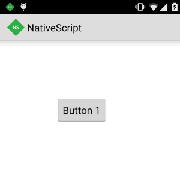
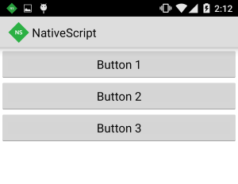
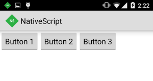
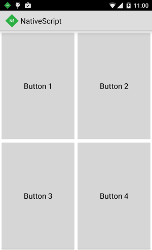
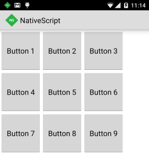
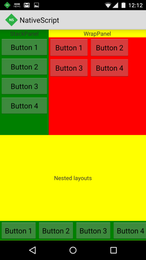

## Lesson 1. Layout

NativeScript provides a flexible layout system that enables you to specify how controls are positioned and shown on the screen. This tutorial goes through the various layout options and demonstrates how to design a user interface that automatically sizes to various screen resolutions.

The NativeScript layout system supports both absolute and dynamic layouts.

**Absolute Layout**

In an absolute layout, controls are positioned using explicit x/y coordinates.

**Dynamic Layout**

In a dynamic layout, the user interface automatically sizes to match the available screen space.

**Layout Panels**

The built-in layout panels in NativeScript are **CanvasPanel**, **StackPanel**, **GridPanel** and **WrapPanel**.

### Step 1. Create a canvas layout

The CanvasPanel is the most basic layout panel in NativeScript. It allows you to position child elements by specifying x/y coordinates relative to the CanvasPanel. Тhe **left**, **top**, **bottom** and **right** properties allow you to set the position of a child element relative to any side of the CanvasPanel. The CanvasPanel is useful for scenarios where the child elements contained within require little to no movement. 

<hr data-action="start" />

#### Action

* **a**. Add the following markup to position a single child inside a CanvasPanel using the top and left properties.

> Tip: Keyboard shortcut `Ctrl` + `Alt` + `F` cleans up indentation and formatting for you. Try using it after you paste in code throughout these lessons.

```
<Page>
    <CanvasPanel>
        <Button text="Button 1" left="100" top="100" />
    </CanvasPanel>
</Page>
```

* **b**. Save the xml file and sync your app.

<hr data-action="end" />



### Step 2. Create a stack layout

The StackPanel arranges its child elements into a single line. It supports both horizontal and vertical orientation. The default value for the orientation property is vertical. StackPanel is typically used in scenarios where you want to arrange a small subsection of the UI on your page.

<hr data-action="start" />

#### Action

* **a**. Add the following markup to create a **vertical** StackPanel of items.

```
<Page>
  <StackPanel orientation="vertical">
    <Button text="Button 1" />
    <Button text="Button 2" />
    <Button text="Button 3" />
  </StackPanel>
</Page>
```

* **b**. Save the xml file and sync your app.

<hr data-action="end" />



#### Action

* **a**. Add the following markup to create a **horizontal** StackPanel of items.

```
<Page>
  <StackPanel orientation="horizontal">
    <Button text="Button 1" verticalAlignment="top"/>
    <Button text="Button 2" verticalAlignment="top"/>
    <Button text="Button 3" verticalAlignment="top"/>
  </StackPanel>
</Page>
```

* **b**. Save the xml file and sync your app.

<hr data-action="end" />



### Step 3. Create a table layout

To achieve table layout you use use the GrapPanel. The Grid panel arranges its children in multi-row and multi-column layouts. You can set the number of rows and columns by using the rowDefinitions and columnDefinitions properties. These properties must be declared immediately within the GridPanel, before adding the child elements. 

**Setting size for rows and columns**

You can set the size of rows and columns by setting a specific size in pixels or by using auto or star sizing. 

**Auto and Star Sizing**

If the size of a row/column is set to auto, it will size to fit its content.  Star sizing is used to distribute available space among the rows and columns of a grid proportionally.

**Positioning child elements**

To position an object in a specific cell the col and row properties must be used. Child elements can span across multiple rows and columns by using the rowSpan and colSpan properties.

<hr data-action="start" />

#### Action

* **a**. Add the following markup to create a GridPanel with **four cells** (two columns and two rows).

```
<Page>
  <GridPanel>
    <GridPanel.columnDefinitions>
      <ColumnDefinition width="*" />
      <ColumnDefinition width="*" />
    </GridPanel.columnDefinitions>
    <GridPanel.rowDefinitions>
      <RowDefinition height="*" />
      <RowDefinition height="*" />
    </GridPanel.rowDefinitions>
    <Button text="Button 1" row="0" col="0" />
    <Button text="Button 2" row="0" col="1" />
    <Button text="Button 3" row="1" col="0" />
    <Button text="Button 4" row="1" col="1" />
  </GridPanel>
</Page>
```

* **b**. Save the xml file and sync your app.

<hr data-action="end" />



<hr data-action="start" />

#### Action

* **a**. Add the following markup to create a GridPanel with two columns where the second column takes twice as much space as the first one.

```
<Page>
  <GridPanel>
    <GridPanel.columnDefinitions>
      <ColumnDefinition width="*" />
      <ColumnDefinition width="2*" />
    </GridPanel.columnDefinitions>
    <Button text="Button 1" col="0" />
    <Button text="Button 2" col="1" />
  </GridPanel>
</Page>
```

* **b**. Save the xml file and sync your app.

<hr data-action="end" />


### Step 4. Create a wrap layout

The WrapPanel is similar to the StackPanel. It starts by arranging the child elements one next to the other and wraps them to new lines if no space is available. The Orientation can be set to Horizontal or Vertical.

**itemWidth** and **itemHeight**

The itemWidth and itemHeight properties can be used to set the same size across all items within the WrapPanel. 

**orientation**

The orientation property can be used to specify the direction in which the WrapPanel arranges its child elements.

<hr data-action="start" />

#### Action

* **a**. Add the following markup to create a WrapPanel with 9 child elements whose width and height is set to 100.

```
<Page>
  <WrapPanel orientation="horizontal" itemWidth="100" itemHeight="100">
    <Button text="Button 1" />
    <Button text="Button 2" />
    <Button text="Button 3" />
    <Button text="Button 4" />
    <Button text="Button 5" />
    <Button text="Button 6" />
    <Button text="Button 7" />
    <Button text="Button 8" />
    <Button text="Button 9" />
  </WrapPanel>
</Page>
```

* **b**. Save the xml file and sync your app.

<hr data-action="end" />



### Step 5. Create a nested layout

The layout system of NativeScript allows you to create complex UIs by nesting panels.

<hr data-action="start" />

#### Action

* **a**. Add the following markup to create nested layouts.

```
<Page>
  <GridPanel>
    <GridPanel.columnDefinitions>
      <ColumnDefinition width="*" />
      <ColumnDefinition width="2*" />
    </GridPanel.columnDefinitions>
    <GridPanel.rowDefinitions>
      <RowDefinition height="*" />
      <RowDefinition height="*" />
    </GridPanel.rowDefinitions>
    <StackPanel row="0" col="0">
      <Label text="StackPanel" horizontalAlignment="center"/>
      <Button text="Button 1" />
      <Button text="Button 2" />
      <Button text="Button 3" />
      <Button text="Button 4" />
    </StackPanel>
    <GridPanel row="0" col="1">
      <GridPanel.rowDefinitions>
        <RowDefinition height="auto" />
        <RowDefinition height="*" />
      </GridPanel.rowDefinitions>
      <Label text="WrapPanel" horizontalAlignment="center" />
      <WrapPanel row="1" itemWidth="100" itemHeight="50">
        <Button text="Button 1" />
        <Button text="Button 2" />
        <Button text="Button 3" />
        <Button text="Button 4" />
      </WrapPanel>
    </GridPanel>
    <GridPanel row="1" colSpan="2">
      <GridPanel.rowDefinitions>
        <RowDefinition height="*" />
        <RowDefinition height="auto" />
      </GridPanel.rowDefinitions>
      <Label text="Nested layouts" horizontalAlignment="center" verticalAlignment="center"/>
      <StackPanel orientation="horizontal" row="1">
        <Button text="Button 1" />
        <Button text="Button 2" />
        <Button text="Button 3" />
        <Button text="Button 4" />
      </StackPanel>
    </GridPanel>
  </GridPanel>
</Page>
```

* **b**. Save the xml file and sync your app.

<hr data-action="end" />



Great job! In just a few minutes, you've mastered some of the critical basics to building native apps with NativeScript and the Telerik Platform. With these skills in hand, creating the navigation, layout and major views in your next mobile app should be a breeze!