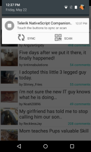

## Lesson 1. Build a photo album

### Step 1. Create a new project

In this tutorial, you will learn how to load data in a UI control, how to bind UI properties to a view model and how to define the style of the UI with CSS. As a result you will have a native Photo Album application written entirely in XML and JavaScript.

An app named `Photo Album Native` has already been created for you. This NativeScript app contains a few images and an SDK which you will need later on. The app’s code is currently open, so let's start by examining its structure: 

* **app** This folder contains the entire app functionality.
* **App_Resources** This folder contains application assets such as icons, splash screens and configuration files such as Info.plist and AndroidManifest.xml.
* **res** This folder contains a few preloaded images for the purposes of the quick-start tutorial.
* **app.css** This is the main CSS file of the application. The styles you define here are applied to the content of all pages. 
* **app.js** This module contains application specific code, such as which page is the starting page of the application. 
* **everlive.all.min.js** This is the JavaScript SDK for the Telerik Backend Services that we will use later in this tutorial.
* **LICENSE** This file describes the license which protects the application's code.
* **main-page.js** This is the main JavaScript file used to implement the business logic of the initial page.
* **main-page.xml** This is the file used to implement the UI of the initial page.
* **package.json** This file contains meta information for your project such as name, author, version. The file also describes what modules (a.k.a widgets or components) you have loaded for your projects. All NativeScript projects start with a default set of modules known as `tns-core-modules`.


### Step 2. Define the user interface

You are now going to create a page that contains a button at the bottom and a listview that spans over the remaining screen area. These two controls will be arranged thanks to a grid layout. You will declare the UI of the page in `main-page.xml`.

<hr data-action="start" />

#### Action 

* **a.** Open the `main-page.xml` file.
* **b.** Between the `Page` start and end tags, create a `GridLayout` instance and set up its layout. For the purposes of the application, the grid should consist of two rows - the first row will take the available space the `GridLayout` provides and the second row will be sized according to its own content:
```
<GridLayout rows="*, auto">
</GridLayout>
```
* **c.** Now, it's time to add a `Button` and a `ListView` to the `GridLayout`. The declarations of the controls should be placed right before the closing tag for the `GridLayout`. These declarations are as simple as:
```
<ListView row="0" />  
<Button row="1" />
```

The complete XML declaration looks like this:
```
<Page xmlns="http://www.nativescript.org/tns.xsd" >
    <GridLayout rows="*, auto">
        <ListView row="0" />
        <Button row="1" />
    </GridLayout>
</Page>
```

<hr data-action="end" />

Regardless of the small amount of UI and settings that you have put on the page, you probably want to try the result on a real device as soon as possible. So, in the next step, let's see how easy it is to deploy this native app.

### Step 3. Deploy your app on a device using the companion app

The NativeScript companion app makes it easy for you to test your app on real devices, without the need to manage SDKs or deal with complex provisioning options.


<hr data-action="start" />

#### Action

* **a.** Get your iOS or Android device.
* **b.** Download and install the NativeScript companion app from the App Store or Google Play, respectively.

[](https://itunes.apple.com/bg/app/nativescript/id882561588?mt=8)
[](https://play.google.com/store/apps/details?id=com.telerik.NativeScript&hl=en)

* **c.** In the browser, select **Run** --> **Build**, select your platform (iOS/Android), choose **NativeScript companion app**, and click **Next**. You will see a QR code pointing to the application. 
* **e.** **Android:** Open the NativeScript app on your device. With the NativeScript app running, open the notification center. Tap **Scan** and use the integrated scanner to scan the QR code displayed in the browser.

* **f.** **iOS:** Open the NativeScript app on your device and with a two-finger left-to-right swipe from far left reveal the companion app menu. Tap **QR Scanner** in the menu and use the integrated scanner to scan the QR code displayed in the browser.


* **e.** **Windows Phone:** A companion app for Windows Phone is not yet available.

<hr data-action="end" />

When scanned, the QR code loads your app in the NativeScript companion app. You should see the button at the bottom and some white space taken from the empty list view. Now that you have the app on your device, let's make some changes to see how easy it is to get application updates without rescanning the QR code.

<hr data-action="start" />

#### Action

* **a.** Set the `text` attribute in the `Button` declaration. The result should look like this:
```
<Button text="Test Message" row="1"/>
```
* **b.** **Android:** With the NativeScript application running, open the notification center and tap **Sync**.
* **c.** **iOS:** With the NativeScript application running, tap with three fingers and hold until a popup appears.

<hr data-action="end" />

Your updated app will be downloaded on the device and you will immediately see the change in the Button text.

This process is known as LiveSync and makes updating your apps as easy as a quick tap. Now that you have an app and can test it on your device, let's populate the `ListView` with items.


### Step 4. Populate a ListView with images

It's time to populate the `ListView` with images. For that purpose, the `Photo Album Native Code` project has already been provisioned with eight images. As discussed earlier, they are located in the `app --> res` folder. These images should be set as the items source of the `ListView`. The items source definition should be created in a view model file and then consumed by the `ListView` in the `main-page.js/main-page.xml` files.

<hr data-action="start" />

#### Action

* **a.** Right-click the `app` folder and choose **Add** --> **New File**. Select `JavaScript` for the file type and  name the file `view-model.js`. This is the place you will define the data model.
* **a.** In the `view-model.js` add the following declarations to load the necessary modules from the `tns-core-modules`: 
```
var observable = require("data/observable");
var imageSourceModule = require("image-source");
var fileSystemModule = require("file-system");
var observableArrayModule = require("data/observable-array");
var enums = require("ui/enums");
```
You need the first one to reflect the view model changes in the UI. The next two are needed to load the image files into the app as image objects. The fourth one is needed for the collection where the image objects will be stored. The last one gives access to the image encoding enumeration that will be needed when you upload images to the cloud in Lesson 2.
* **b.** Create an `ObservableArray()` and add the images there using the `push` method:
```
var localImagesArray = new observableArrayModule.ObservableArray();
var directory = "/res/";
function imageFromSource(imageName) {
    return imageSourceModule.fromFile(fileSystemModule.path.join(__dirname, directory + imageName));
};
var item1 = {itemImage: imageFromSource("01.jpg")}; 
var item2 = {itemImage: imageFromSource("02.jpg")}; 
var item3 = {itemImage: imageFromSource("03.jpg")}; 
var item4 = {itemImage: imageFromSource("04.jpg")}; 
var item5 = {itemImage: imageFromSource("05.jpg")}; 
var item6 = {itemImage: imageFromSource("06.jpg")}; 
localImagesArray.push([item1, item2, item3, item4, item5, item6]);
var item7 = {itemImage: imageFromSource("07.jpg")}; 
var item8 = {itemImage: imageFromSource("08.jpg")}; 
```
Note that two of the images are not pushed to the array. This is because you will add them later on a button tap.
* **c.** Create the view model as an instance of type `Observable()`. Let's call this instance `photoAlbumModel`:
```
var photoAlbumModel = new observable.Observable();
```
<hr data-action="end" />

Using the `Observable()` type of our view model lets you bind controls properties from the main page to properties in the view model.

**Tip**: Keyboard shortcut `Ctrl` + `Alt` + `F` cleans up the JavaScript indentation and formatting for you. Try using it after you paste in code throughout these lessons.

<hr data-action="start" />

* **d.** Expose a `photoItems` property at the `photoViewModel` that returns the `ObservableArray` containing the images:
```
Object.defineProperty(photoAlbumModel, "photoItems", {
      get: function () {
          return localImagesArray;
      },
      enumerable: true,
      configurable: true
  })
```
* **e.** At the bottom of the `view-model.js` file declare `photoAlbumModel` in the module `exports` to make this model accessible from the UI.
```
exports.photoAlbumModel = photoAlbumModel;
```

<hr data-action="end" />

With the view model created, let's get back to our `main-page.js/main-page.xml` files to populate `ListView` with data.

<hr data-action="start" />

* **f.** In the `main-page.js` file, load the view model specifying its location in the project folder structure and then load the pre-created instance of `photoAlbumModel`. 
```
var modelModule = require("./view-model");
var model = modelModule.photoAlbumModel;
```
* **g.** Create a function called `onPageLoaded`. In this function you will set the `bindingContext` of the page to be our view model:
```
function onPageLoaded(args) {
    var page = args.object;
    page.bindingContext = model;
}
```
* **h.** Set the `exports.onPageLoaded` at the end of `main-page.js` to make the `onPageLoaded` function accessible from the UI:
```
exports.onPageLoaded = onPageLoaded;
```
* **i.** To call the `onPageLoaded` method when the page loads, add the loaded attribute with value `onPageLoaded` in the `Page` tag in `main-page.xml`:
```
<Page loaded="onPageLoaded" xmlns="http://www.nativescript.org/tns.xsd" >
```
* **j.** You now should bind the `ListView` to the `photoItems` collection of the `photoAlbumModel`. To do this, set the `items` attribute of the `ListView` tag to `{{ photoItems }}`:
```
<ListView items="{{ photoItems }}" row="0"/>
```
* **k.** The `ListView` is now bound to the collection of images. But in order to display the images, you should set the appropriate template consisting of a `GridLayout` with an `Image` object inside. Place the template declaration between the `ListView` start and end tags and bind the `Image`'s `imageSource` property to the `itemImage` property of the `photoItems` objects:
```
<ListView items="{{ photoItems }}" row="0">
	<ListView.itemTemplate>                
		<GridLayout>
			<Image imageSource="{{ itemImage }}" row="0"/>
		</GridLayout>               
	</ListView.itemTemplate>
</ListView>
```

<hr data-action="end" />

As a result, the `ListView` is populated with images. Use the LiveSync feature of the NativeScript companion app to see them. Let's now add two more images on a button tap and style the button.


### Step 5. Respond to events and add some style

The `ListView` is already populated with a few images. You will now add a few more images on a button tap. Then, you will learn how to bind the Button's `text` property to a property of the `photoAlbumModel`, thus informing the end-user about the successful tap action. Finally, you will understand how to put some style to the button.

<hr data-action="start" />

#### Action

* **a.** Open the `view-model.js` file and create a function called `tapAction` at `photoAlbumModel`. In the body of this function add two more images to the `ObservableArray` instance.
```
photoAlbumModel.tapAction = function () {
	localImagesArray.push(item7);
	localImagesArray.push(item8);
};
```
* **b.** In the `main-page.xml` file, set the `tap` attribute of the `Button` tag to the `tapAction` function of the `photoAlbumModel`. This will call the function when the button is tapped:
```
<Button text="Test Message" row="1" tap="{{ tapAction }}"/>
```

<hr data-action="end" />

Tapping the Button will now add two more images to the ListView. But let's make the text of the Button reflect the action that happened. To do so, you can bind the `text` property of the Button to the `message` property of the `photoAlbumModel`.

<hr data-action="start" />

#### Action

* **a.** In the `view-model.js` file, add the following line right after the line where the `photoAlbumModel` instance was created. This line will prompt the user to add more images:
```
photoAlbumModel.set("message", "Add new photos");
```
* **b.** In the `tapAction` function, add the following line to inform the user about the new images and the total count of images in the ListView:
```
photoAlbumModel.set("message", "Images added. Total images: " + localImagesArray.length);
```
* **c.** In `main-page.xml`, set the `text` attribute of the `Button` tag to `{{ message }}`. This will bind the `Button`'s `text` property to the `message` property of the `photoAlbumModel`. So, initially, the button will show `Add new images` and after you tap it, it will show `Images added. Total images: 8`.
```
<Button text="{{ message }}" row="1" tap="{{ tapAction }}"/>
```

<hr data-action="end" />

Finally, let's beautify the button. NativeScript uses standards-based CSS syntax to style the UI elements.

<hr data-action="start">

#### Action

* **a.** Open the `app.css` file.
* **b.** After the block for the `page` objects, add a block for the `Button` that determines the foreground color, background color and font properties of the `Button` type. The complete code in `app.css` looks like this:

```
page {
    /* CSS styles */
}

Button {
  background-color: gray;
  font-size: 20;
  color: #3BB9FF; 
}
```
<hr data-action="end">

This is it! Now you know how to load data in a UI control, how to bind UI properties to a view model and how to define the style of the UI with CSS.

Use LiveSync to update the application on the device and see the results.